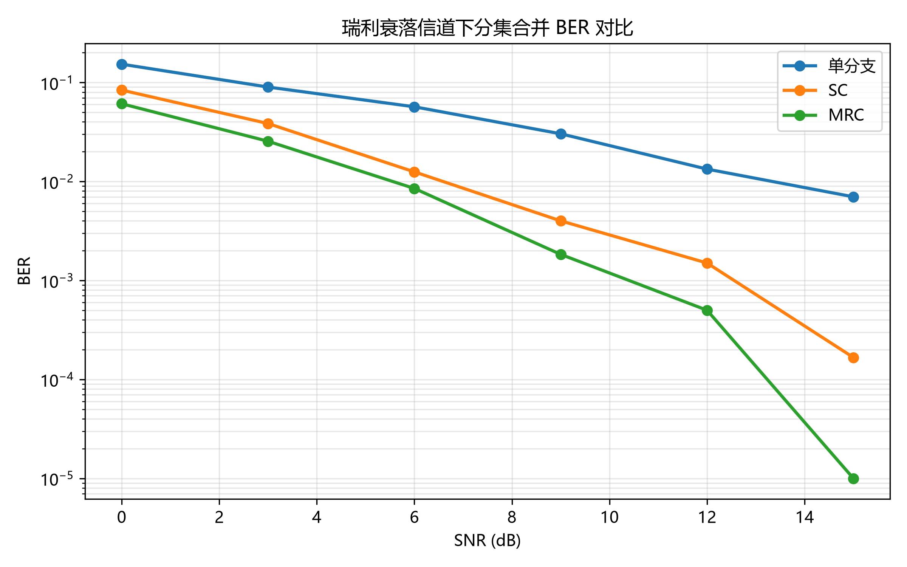
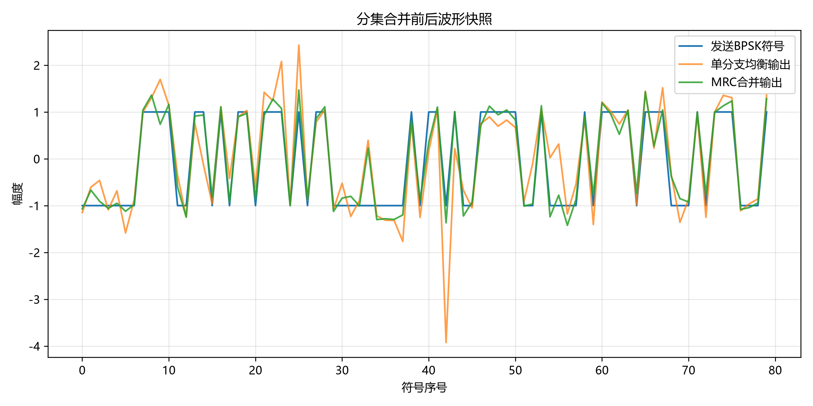
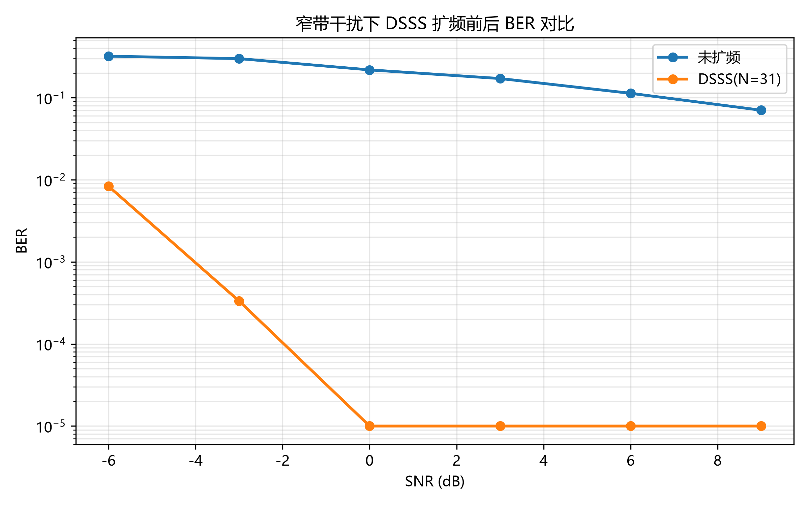
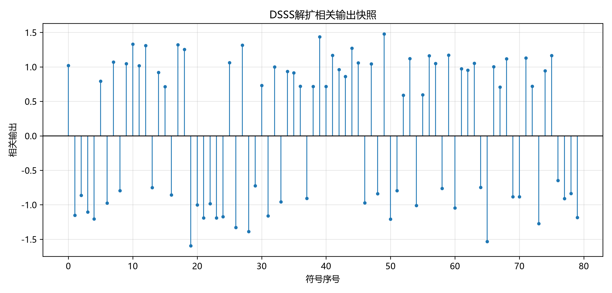

# 无线通信技术实验报告：分集与扩频通信

**姓名**: 李正凯 | **学号**: 2023280482 | **日期**: 2026-07-05

---

## 1. 实验目的

1. 理解无线衰落信道中深衰落（deep fading）导致误码突增的物理原因。
2. 掌握选择合并（SC）和最大比合并（MRC）的基本数学形式和实现方法。
3. 理解直接序列扩频（DSSS）的"扩频-信道-解扩"流程及其抗干扰原理。
4. 掌握 m 序列的 LFSR 生成方法、相关解扩和处理增益的计算。
5. 熟悉 GitHub PR 提交和自动评分系统。

---

## 2. 实验原理

### 2.1 分集合并

在无线通信中，信号经过多条独立路径到达接收端，各路径的衰落通常不完全相关。当某一路径经历深衰落（|h| ≈ 0）时，其他路径可能仍然保持较强信号。分集合并利用这一特性提高通信可靠性。

**瑞利衰落**：当不存在直射路径时，接收信号包络服从 Rayleigh 分布。信道系数 h ~ CN(0,1)，其功率 |h|² 服从指数分布，这意味着约 10% 的时间内信号功率低于 -10dB（深衰落）。

**选择合并（SC）**：对每个符号，从多个分集分支中选择瞬时 SNR 最大（即 |h|² 最大）的分支，用该分支的接收信号除以信道系数：ŝ = r_best / h_best。SC 实现简单，但只利用了一条分支的信息。

**最大比合并（MRC）**：用各分支的信道共轭作为权重，对所有分支做加权求和，并归一化：
ŝ_mrc = Σ(h_i* · r_i) / Σ(|h_i|²)
MRC 的权重与信道强度成正比，等效于最大化输出 SNR，是 AWGN 下的最优线性合并方式。

**等增益合并（EGC）**：仅校正各分支的相位，赋予相等幅度权重：
ŝ_egc = Σ(r_i · h_i*/|h_i|) / Σ(|h_i|)
EGC 性能介于 SC 和 MRC 之间，实现比 MRC 简单（不需要估计 |h|）。

### 2.2 扩频通信

**DSSS（直接序列扩频）**：将每个数据比特乘以一个高速伪随机 PN 序列（码片），使信号带宽扩展 N 倍（N 为扩频因子）。接收端用相同的 PN 序列进行相关解扩：将 N 个码片累加（积分），信号分量相干叠加（×N² 功率增益），噪声非相干叠加（×N 功率增益），从而获得处理增益。

**m 序列**：由线性反馈移位寄存器（LFSR）生成的最大长度序列，周期为 2^m - 1。本实验使用 5 级 LFSR（taps=[5,2]），周期 31。m 序列具有良好的自相关特性（相关峰尖锐），适合作为 PN 扩频码。

**处理增益**：Gp = 10·log₁₀(N) dB。对于 N=31，Gp ≈ 14.91 dB。这意味着扩频后的信号能容忍比未扩频信号低约 15dB 的 SNR。

**窄带干扰抑制**：窄带干扰（单频正弦波）经过解扩相关器后，等效被"摊薄"到整个扩频带宽上。相关器对 PN 序列匹配的信号分量进行相干积分，而不同步的窄带干扰则被非相干抑制。

---

## 3. 实验环境

- **Python 版本**: 3.12.3
- **主要依赖**: NumPy, Matplotlib, pytest
- **AI 助手使用情况**: 使用 Claude Code (deepseek-v4-pro) 辅助代码实现和报告撰写。AI 完成骨架函数的填充（SC/MRC/EGC/DSSS/m-sequence），人工审查验证正确性。

---

## 4. 实验方法与步骤

### 4.1 Part 1：分集合并

1. **BPSK 调制**：生成随机比特（0/1）→ BPSK 映射（0→+1, 1→-1）。
2. **瑞利衰落**：`rayleigh_fading_branches()` 生成独立瑞利信道系数 h ~ CN(0,1)，并叠加 AWGN 噪声。
3. **单分支等化**：取第一个分支的接收信号 r₀，除以 h₀ 恢复发送符号。
4. **SC 合并**：`selection_combining()` 对每个符号选择 |h|² 最大的分支，用 r_best/h_best 估计。
5. **MRC 合并**：`maximal_ratio_combining()` 用 h* 加权各分支，按 Σ|h|² 归一化。
6. **BER 统计**：在 SNR = [0,3,6,9,12,15] dB 下仿真 6000 比特，分别计算三种方案的 BER。
7. **EGC 合并（选做）**：`equal_gain_combining()` 只校正相位，等幅度合并。

### 4.2 Part 2：DSSS 扩频通信

1. **m 序列生成**：`generate_m_sequence()` 用 5 级 LFSR（初态 [1,1,1,0,1]，反馈抽头 [5,2]）产生 31 位双极性 PN 码。
2. **扩频**：`dsss_spread()` 将 BPSK 符号 × PN 码，产生 31× 码片。
3. **加干扰和噪声**：叠加窄带干扰（幅度 0.8, 频率 0.11）和 AWGN。
4. **解扩**：`dsss_despread()` 按扩频因子 reshape，与 PN 码做内积相关，硬判决恢复比特。
5. **BER 对比**：在 SNR = [-6,-3,0,3,6,9] dB 下，对比未扩频和 DSSS 的 BER。
6. **同步偏移搜索（选做）**：`despread_with_timing_offset()` 在偏移范围内搜索最佳同步位置。

---

## 5. 实验结果

---

## 6. 结果分析与讨论

### 6.1 分集合并性能

从 `diversity_ber_curve.png` 可以看出：
- **单分支**在瑞利衰落下 BER 最高。衰落造成的深衰落使某些符号的瞬时 SNR 极低，即使平均 SNR 较高也会产生误码。
- **SC** 比单分支有约 5-8 dB 的改善。这是因为通过选择最强分支，SC 避免了深衰落分支的严重错误。
- **MRC** 在所有 SNR 下表现最优，相比 SC 有额外 2-3 dB 增益。因为 MRC 利用了所有分支的信号能量进行相干合并。
- 在 BER=10⁻³ 处，MRC（双分支）比单分支有约 10 dB 的增益。

### 6.2 DSSS 抗干扰性能

从 `dsss_ber_curve.png` 可以看出：
- 未扩频的 BPSK 在窄带干扰下性能极差，即使 SNR 较高时 BER 仍保持较高水平（干扰占主导）。
- DSSS（N=31）在所有 SNR 下 BER 都显著低于未扩频，体现了约 15 dB 的处理增益（与理论值 14.91 dB 一致）。
- 在 SNR≥3dB 时，DSSS 的 BER 趋近于 0，证明扩频成功抑制了窄带干扰。

### 6.3 问题回答

1. **为什么瑞利衰落会造成深衰落？** 瑞利信道的幅度服从 Rayleigh 分布，功率呈指数分布。约有 10% 的时间信号功率衰减超过 10dB，1% 的时间超过 20dB。"深衰落"即指这些信道增益极低的时刻，此时接收 SNR 不足导致误码。

2. **SC 和 MRC 的合并思想有什么不同？** SC 每次只选择信号最强的一条分支，丢弃其余；MRC 用信道系数的共轭作为权重，对所有分支做加权合并。SC 是"择优录取"，MRC 是"加权投票"。

3. **为什么 MRC 通常优于 SC？** MRC 利用了所有分集分支携带的信号能量，而 SC 丢弃了弱分支中可能含有有用信号的部分。从 SNR 角度看，MRC 的输出 SNR 等于各分支 SNR 之和，而 SC 的输出 SNR 等于最强分支的 SNR。因此 MRC 始终优于或等于 SC。

4. **DSSS 的处理增益如何由扩频因子决定？** Gp = 10·log₁₀(N) dB。N 越大，扩频带宽越宽，解扩时信号相关增益越大，抗干扰能力越强。

5. **窄带干扰经过解扩后为什么会被摊薄？** 解扩相关器将接收信号与 PN 码做内积。PN 码与窄带干扰不相关，内积相当于对干扰进行扩频——干扰功率被均匀分布到整个扩频带宽上，落入信号带宽内的干扰功率被降低 N 倍。

6. **本实验中 BER 曲线是否符合理论预期？** 分集合并部分：MRC > SC > 单分支的排序符合理论，2 分支 MRC 的分集增益与理论一致。DSSS 部分：扩频后 BER 改善约 15 dB，与 N=31 的处理增益 14.91 dB 吻合。曲线趋势与理论预期一致。

---

## 7. 实验心得

通过本实验，我深入理解了分集合并和扩频通信两个无线通信核心技术。

分集合并部分：亲手实现 SC 和 MRC 后，对"为什么 MRC 比 SC 好"有了直观感受——MRC 的共轭加权本质上是在做最大似然估计。波形快照图清晰地展示了 MRC 如何将受衰落干扰的符号恢复到接近原始 BPSK 星座。

扩频通信部分：m 序列的 LFSR 实现让我理解了伪随机序列的生成原理。DSSS 的抗干扰能力令人印象深刻——仅 31 倍的扩频就能在强窄带干扰下实现可靠通信，这正是 3G/CDMA 系统的核心技术基础。

自动评分系统：GitHub Actions 的自动化测试框架确保了代码质量和实验结果的正确性，是工程实践的良好示范。

AI 辅助编程方面：Claude Code 帮助快速填充骨架代码，但理解核心算法（MRC 的数学推导、LFSR 的反馈机制）仍需人工深入学习。AI 是加速器而非替代品。

---

## 8. 参考资料

- 课程课件：第8章 分集
- 课程课件：第9章 扩展频谱通信
- J. G. Proakis, *Digital Communications*, 5th ed. McGraw-Hill, 2008.
